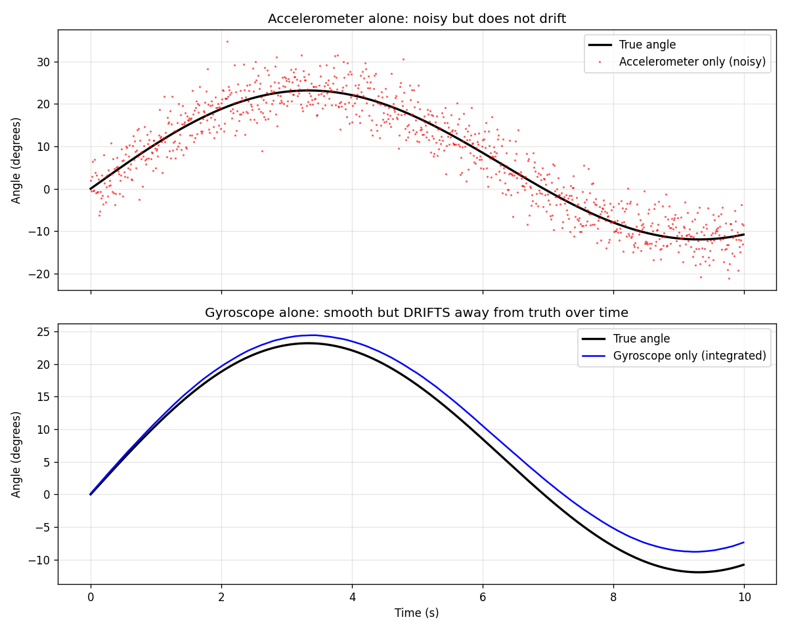
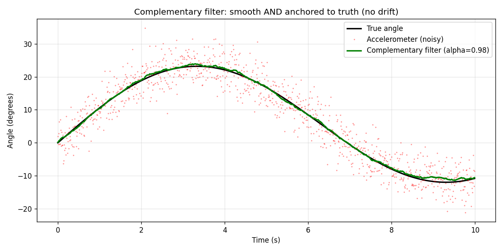
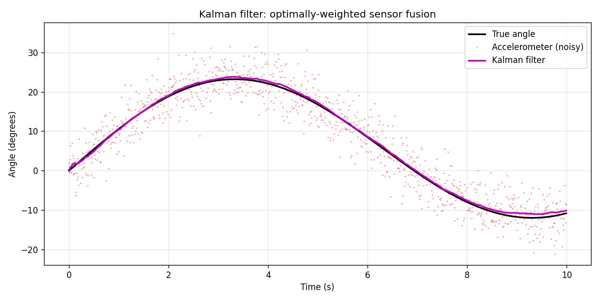

# IMU Sensor Fusion: Complementary Filter vs Kalman Filter

A from-scratch implementation of two classic sensor fusion techniques used in
inertial navigation and drone/robotics attitude estimation, built to
understand the core math behind Guidance, Navigation & Control (GNC) systems.

## The problem

An accelerometer and a gyroscope each measure orientation in a flawed way:

- **Accelerometer**: gives a noisy angle estimate on every sample, but the
  noise doesn't accumulate over time.
- **Gyroscope**: gives a smooth angular rate, but integrating it over time
  causes the angle estimate to **drift** away from the truth, even from a
  small constant bias.

Neither sensor alone is good enough. This project simulates both sensors
(with realistic noise and gyro bias) and implements two ways to fuse them.



## Method 1: Complementary Filter

A simple weighted average that leans on the gyroscope short-term and the
accelerometer long-term:

```
angle = alpha * (angle_prev + gyro_rate * dt) + (1 - alpha) * accel_angle
```

**Result:** 88% lower RMS error than the raw accelerometer signal.



## Method 2: Kalman Filter

A more principled approach: instead of a fixed weighting, the Kalman filter
computes the *optimal* weighting (the "Kalman gain") at every timestep, based
on the current uncertainty of the estimate and the known noise level of each
sensor. It runs a predict/update cycle:

1. **Predict** — use the gyroscope to project the angle forward, and grow
   the uncertainty estimate (since the prediction can drift).
2. **Update** — correct the prediction using the accelerometer reading,
   weighted by how much the current uncertainty vs sensor noise favors
   trusting the new measurement.

**Result:** ~88% lower RMS error than the raw accelerometer signal, comparable
to the complementary filter in this simple simulation. The Kalman filter's
real advantage over a fixed-weight complementary filter shows up when noise
levels change over time or need to be *estimated* rather than hand-tuned —
which is the direction I plan to extend this project next (see below).



## What I'd extend next

- Apply this to **real hardware data** from an MPU6050 IMU logged over an
  ESP32, instead of simulated data (in progress — see companion repo)
- Extend to 2D/3D orientation (pitch + roll) instead of a single angle
- Estimate sensor noise parameters directly from real stationary-sensor data
  rather than hand-tuning them

## Why I built this

I'm an embedded systems student (Master ESECA, Toulouse INP-ENSEEIHT)
interested in GNC and inertial navigation. I'd previously worked on sensor
calibration and threshold-based detection in two hardware projects (an
IEEE-published magnetic sensor calibration project, and a GPS/accelerometer
fusion project), and wanted to properly understand the underlying math of
sensor fusion rather than just the applied threshold logic I'd used before.

## Requirements

```
pip install numpy scipy matplotlib
```

## Running it

```
python 01_simulate_data.py       # generates simulated_data.npz
python 02_show_problem.py        # shows why raw sensors fail alone
python 03_complementary_filter.py
python 04_kalman_filter.py
```
